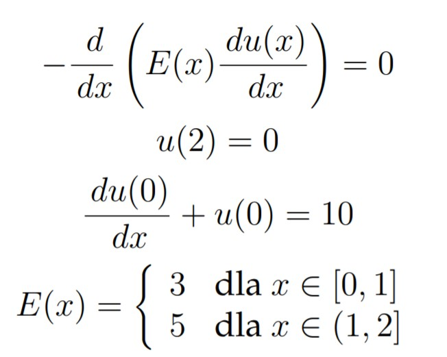
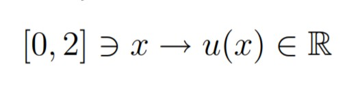

Program napisano w języku Minizinc, z użyciem solvera Gurobi. Nie gwarantuje się poprawnego działania dla innych solverów. 
Z powodu braku bibliotek graficznych wykresy stworzono z wykorzystaniem Excela dla n=5 oraz n=10.
